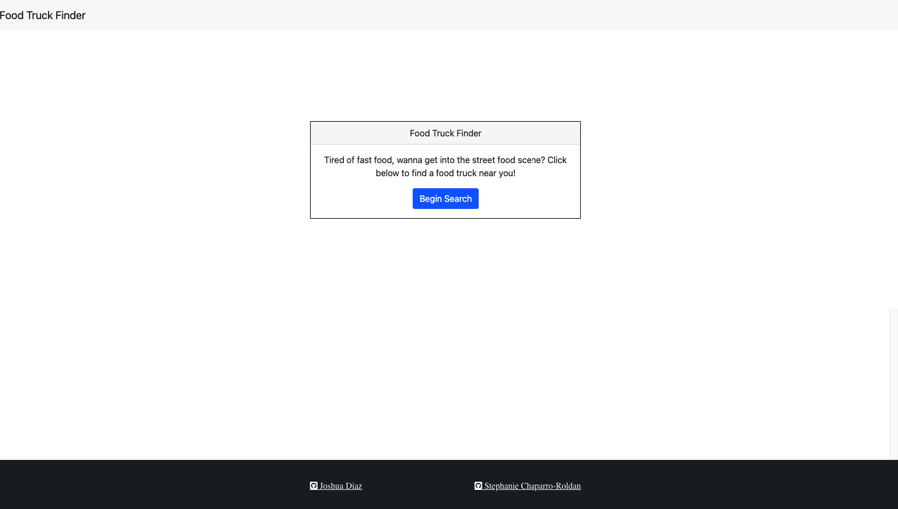

# book-search-engine
## Description

### Food Truck Finder is a web application that uses the Google Places and the Google Geocoding API's to find the local food trucks in your area, based on city, state or zip code.

## Location

> 

> [repo link](https://github.com/Jdiaz240/foodTruckFinder)

> [live link](https://jdiaz240.github.io/foodTruckFinder/)

# Table of contents 

1. [Description](#description)

2. [Location](#location)

3. [Licenses](#licenses)

4. [Installation](#installation)

5. [Questions](#questions)

## licenses 

## Installation
Click the live link above! 

## Questions
### Joshua Diaz
### jad996@live.com
 ### Stephanie Chaparro-Roldan
### schaparro2021@gmail.com

>GitHub username: jdiaz240 & schaparro08
